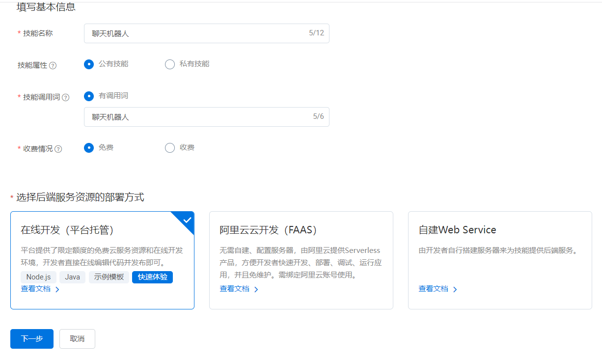

# 天猫精灵终端接入

## 准备工作

- 天猫精灵终端
- 天猫精灵开发者账号（阿里云账号）
- 运行Nonebot等工程的相应环境（需要公网环境）

> 注意：由于平台受限，本套方案只支持消息私聊和群聊功能，不支持消息推送。消息推送可参考其他方案。

## 步骤

### 第一步：平台配置

1.登陆[天猫精灵开放平台](https://product.aligenie.com/) ，选择“应用内容接入”-“技能应用平台”，如图1所示。


2.点击“控制台”，进入个人控制台界面，如图2所示。


3.选择“我的技能应用”标签，点击“创建新技能”，进入技能配置页面。

语音技能：选择“自定义技能”

填写基本信息：

* 技能名称：建议填写中文，最终显示在天猫精灵的控制台上
* 技能属性：可以选公有技能，只要后面不发布就可以一直自己用
* 技能调用词：用于标识该技能的名称，需要在唤醒天猫精灵后对其进行语音控制的关键词，建议填写方便天猫精灵识别的文字，比如“聊天机器人”
* 收费情况：可以选择免费
* 选择后端服务资源的部署方式：这里直接选择“自建Web Service”，这说明将我们的Nonebot2项目作为天猫精灵的后端。“在线开发（平台托管）”和“阿里云云开发（FAAS）”是利用了平台的能力在线上环境开发，这里不能用

配置好后如图3所示



4.点击“下一步”后同意条款，然后点击上面“语音交互模型”标签，进入相应的设置页面，然后选择“创建意图”去创建一个意图。

> 注意：从这一步开始就是实现iotbot的默认功能。读者可以按照自己的思路配置不同的意图并结合后端代码实现自定义功能。

意图信息

* 意图名称：可以用中文，概括这个服务的功能，比如“对话”
* 意图标识：用英文，这里要作为后端接受的参数，比如“dialog”
* 意图描述：简短的概括一下
* 设为默认意图：建议开启这个开关，这表明唤醒天猫精灵后会直接进入这个意图

前置意图

没有前置意图

单轮对话表达

在“例句”后面直接输入用户可能的命令或者问题，比如“给某用户发送某消息”，填好了回车。并在下面的“给某用户发送某消息”中选中“某用户”并设置成自定义实体target，如图4。


同理，“某消息”设置成content。

参数

上面设置完成以后参数部分会多出两个参数，并关联好相应的实体。参数的其他配置保持默认不变。配置好后如图5所示。


最后选择提交。

5.之后点击左边的实体，填写对应的实体值，即用户可能会说什么

点击表格中的“编辑”，进入编辑页面。然后在实体值中选择“添加实体”单选按钮，在输入框内输入对应的实体。比如target实体就是QQ昵称，content实体就是用户要发送的内容，如图6所示。


> 注意：这里也可以选择“动态获取实体”，但是这个功能需要以来淘宝的开放平台，在开发平台上创建项目并通过相应的TOP SDK更新实体库。但是这种方法也是需要在用户使用之前就要确定下来实体库，同样不能更新内容实体。

6.点击上面“后端服务”标签，建立一个后端服务。其中，“自建服务器配置方式”选择“所有意图绑定同一个服务”。然后点击“下载认证文件”，这个认证文件是一个txt文件，文件名和内容需要在项目中配置，详见第二步。然后在“服务器部署地址”中填写服务器IP（或域名）地址。点击“下一步”，期间会向目标服务地址发送一次认证请求，认证成功后方可完成本次更新。

7.点击上面“测试”标签，在输入框中输入消息可以进行测试，如图7所示。


最后点击“真机测试”标签，打开测试开关后就可以和天猫精灵终端进行配对，实现天猫精灵发送消息。

### 第二步：项目开发

1.`.env`文件配置

在上一步中获取了认证文件可以将文件名和内容放在`.env`文件下，例如：

```text
ALI_GENIE_AUTHENTICATION_PATH=/aligenie/xxxxx.txt
ALI_GENIE_AUTHENTICATION_RESPONSE=yyyyy
```

项目启动后会自动读取该配置作为验证请求的返回结果

2.启动

只需要在`bot.py`中添加以下代码即可。
```python
from iot.core import Iot
from iot.devices import ali_genie

Iot.start("AliGenie")
```
然后可以通过docker等方式启动服务。

> 注意：别忘记修改HOST和PORT。

3.自定义行为

以上过程中是实现了基本的消息发送功能，如果想通过天猫精灵终端实现其他功能，比如说建群，编辑名片等操作则需要自己实现。同样也包括 __平台配置__ 和 __项目开发__ 两部分，在项目中可以新建插件通过iotbot的装饰器实现。

```python
from iot.devices.ali_genie import AliGenie, AliGenieResponse, AliGenieRequest

@AliGenie.custom_api
async def _(request: AliGenieRequest) -> AliGenieResponse:
    ...
```