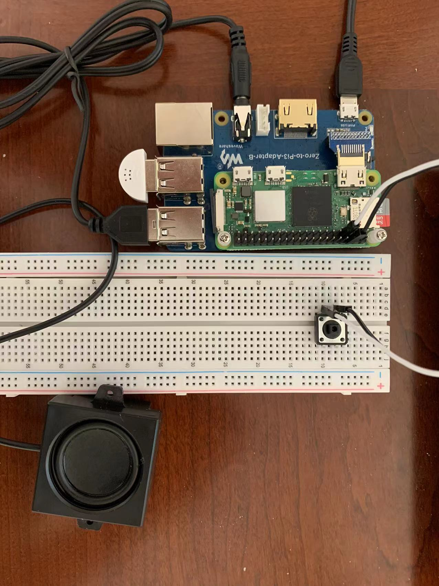
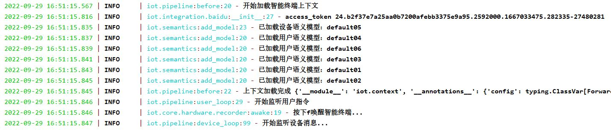
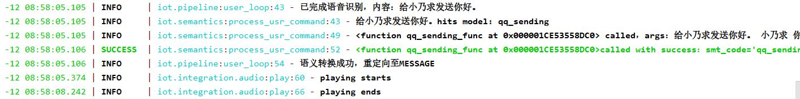
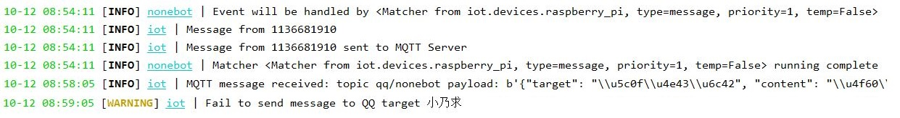
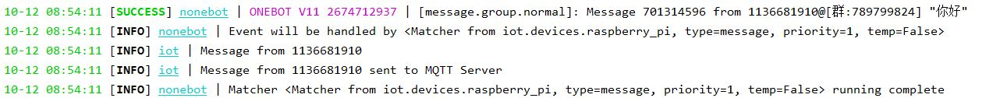
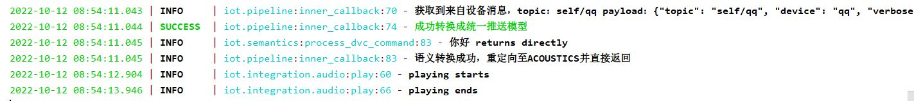

# 树莓派终端接入

## 准备工作

- 树莓派（Raspberry Pi 3/4/zero w均可，但是要能联网）
- 扬声器、麦克风（最好是免驱动的）
- 开关、面包板、杜邦线、充电线等

## 步骤

### 第一步：树莓派硬件搭建

首先需要将树莓派改造成类似天猫精灵一样的智能音箱（智能终端），按照如下图所示的样子搭好。



我用的是Raspberry Pi Zero 2W树莓派，由于接口不够，所以外接了扩展板。然后连接麦克风和扬声器、开关。

> 开关是可以改造成语音唤醒的（KWS），具体参考附录《手把手教你做一个天猫精灵》系列。

### 第二步：fubuki-iot部署

其次，登陆到树莓派并下载最新的的物联网终端框架 `fubuki-iot` 。

```shell script
pip install fubuki-iot
```

创建一个 `.env`文件，并写入以下配置：

```text
BAIDU_API_KEY=你的百度API Key
BAIDU_SECRET_KEY=你的百度Secret Key
BAIDU_ACCESS_TOKEN=
```

创建一个python文件 `app.py` ，并写下以下内容：

```python
from iot import Terminal

if __name__ == '__main__':
    Terminal.run()
```

运行 `app.py` ，如果能正常打印则说明启动成功。

 

> 如果需要通过树莓派的按钮或者语音唤醒智能终端则需要对内置录音模块改造（DEVICE_REC），具体参考附录《手把手教你做一个天猫精灵》。

### 第三步：MQTT服务器部署

除了部署树莓派的服务还需要部署消息服务器，我采用的是 [EMQX](https://www.emqx.io/) 的MQTT服务器。点击 [这里](https://github.com/emqx/emqx/releases/) 下载并解压，然后运行以下内容。
这个服务器可以部署在任何地方，建议部署本地PC。

```shell script
cd ${emqx文件根目录}/bin
emqx start
```
修改树莓派中的fubuki-iot的 `.env` 文件，添加一行。

```text
MQTT_HOST=本地网络下本地PC的IP，一般是192.168开头的
```

重新启动fubuki-iot。

登录MQTT服务器（默认127.0.0.1:18083），输入用户名admin、密码public即可登录。登陆即可看到树莓派端已经订阅了一个Topic。


### 第三步：nonebot部署

在 `bot.py` 中写入以下内容（可以更改成合适的Adapter）：

```python
import nonebot
from nonebot.adapters.onebot.v11 import Adapter

from iot.core import Iot
from iot.devices import raspberry_pi

nonebot.init()
driver = nonebot.get_driver()
driver.register_adapter(Adapter)
config = driver.config
Iot.start("RaspberryPi")

if __name__ == "__main__":
    nonebot.run()
```

至此，在群里艾特机器人内容就会转发给树莓派并通过语音播放出来，而对着树莓派说“给XXX发送XXX”就可以给指定的群或者个人发送消息。









## 附录

- [《手把手教你做一个天猫精灵》系列](https://juejin.cn/column/7149407148701663240)